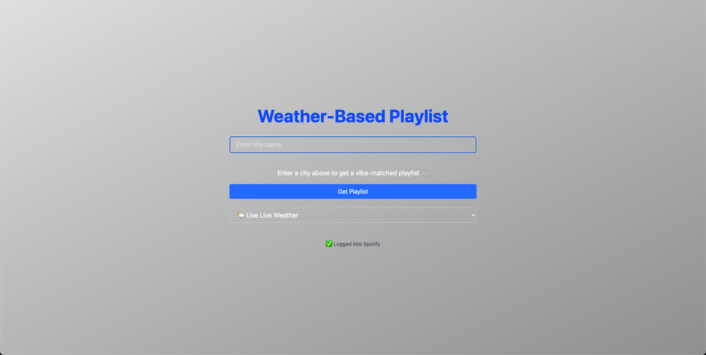
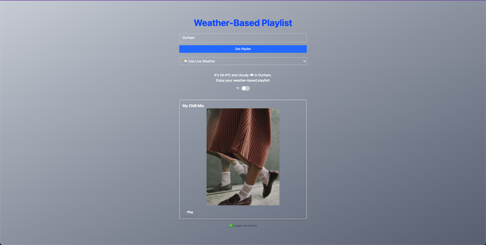

# 🎵 Weather-Based Playlist App

A React + TypeScript web app that recommends a Spotify playlist based on your local weather conditions.

## 🌦️ What It Does

- Users enter a city name
- The app fetches live weather data via the Open-Meteo API
- Based on the weather code, it matches a vibe-specific Spotify playlist
- Users can:
  - Manually override weather type
  - Switch between °C and °F
  - Start or pause music using Spotify Web Playback SDK

## 🧰 Tech Stack

- **Frontend**: React, TypeScript, TailwindCSS
- **APIs**: Open-Meteo (weather), Spotify Web API (music)
- **Auth**: Spotify OAuth + token storage with localStorage
- **Playback**: Spotify Web Playback SDK

## 📸 Screenshots

| Input City | Playlist Match |
|------------|----------------|
|  |  |

> Replace with your actual screenshot file paths once you take them.

## 🚀 Getting Started

1. Clone the repo  
2. Run `npm install`  
3. Create a Spotify Developer App and configure your `redirect_uri`  
4. Start with `npm run dev`  

## 🔐 OAuth Setup (Spotify)

- Redirect URI: `http://localhost:3000`
- Scopes required: `user-read-playback-state`, `user-modify-playback-state`, `streaming`

## 🎯 To-Do / Stretch Goals

- Add genre toggle
- Save favorite playlists
- Light/dark theme toggle
- Mobile UI polish

---

## 👨‍💻 Author

Built by Zach ([@zdotg](https://https://github.com/zdotg))

